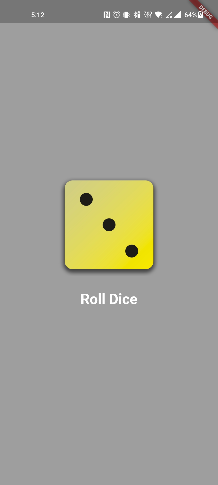
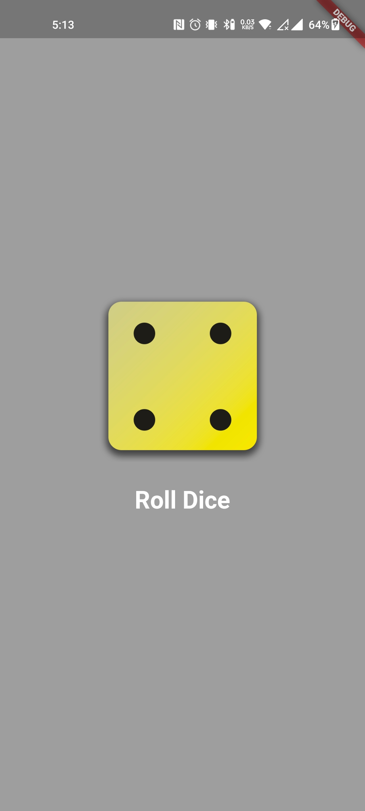
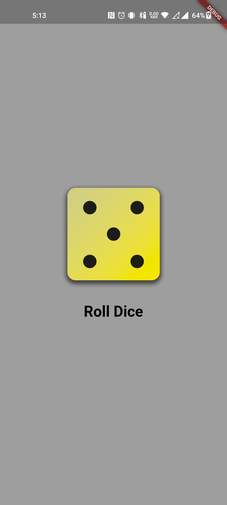

<h1>Dice App</h1>

This is a simple dice app that gives a random number on dice roll.

<h2>Features</h2>

<ul>
<li>Generates a random number between 1 and 6</li>
<li>Can be used for games, such as Yahtzee or Dungeons & Dragons</li>
<li>Easy to use</li>
</ul>

<h2>Getting Started</h2>

To get started, simply download the app and run it.

Once the app is running, click on the "Roll Dice" button to generate a random number.

<h2>Screenshots</h2>

Here are some screenshots of the app in action:

<h2>Contributing</h2>

If you would like to contribute to the app, please fork the project on GitHub and submit a pull request.

<h2>License</h2>

The app is licensed under the MIT License.

<h2>Contact</h2>

If you have any questions or feedback, please contact me at [email protected] 

</body>
</html>
