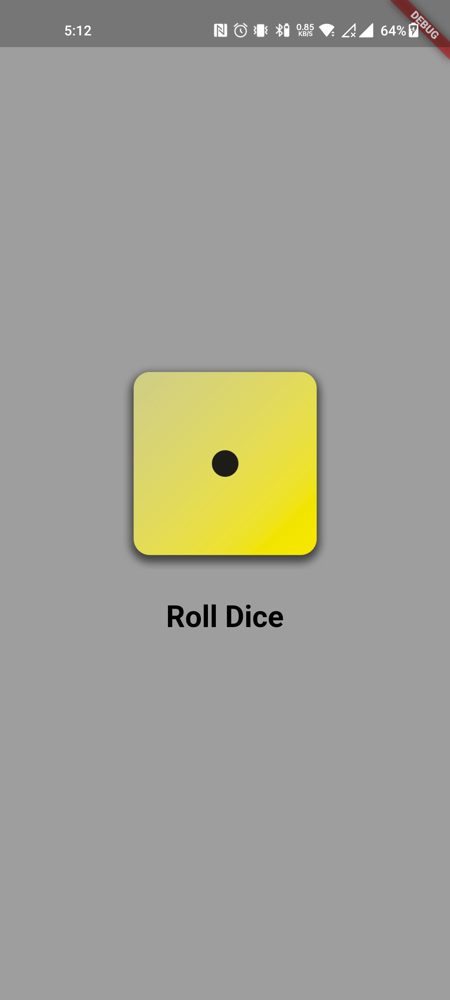
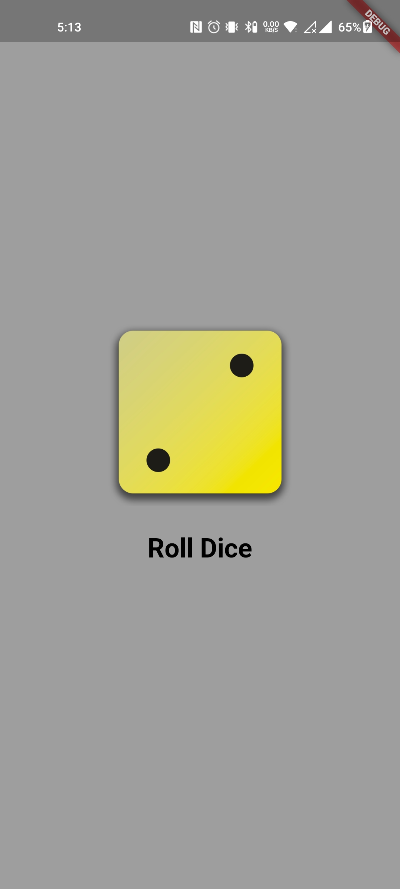
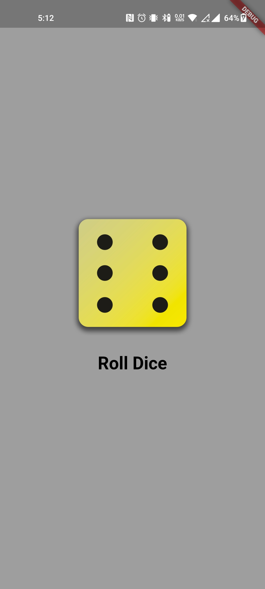

# Flutter Basic Dice App

<p>This is a simple dice app that gives a random number on dice roll.</p> 

<h2>Screenshots</h2>

<p>Here are some screenshots of the app in action:</p>

<p align="center">
  <table>
    <tr>
      <td style="padding-right: 20">
        
      </td>
      <td>
        
      </td>
      <td>
        
      </td>
      <td>
        
      </td>
      <td>
        
      </td>
      <td>
        
      </td>
    </tr>
  </table>
</p>

<h2>Features</h2>

<ul>
<li>Generates a random number between 1 and 6</li>
<li>Can be used for games, such as Yahtzee or Dungeons & Dragons</li>
<li>Easy to use</li>
</ul>

## Getting Started

1. Clone this repository.
   ```sh
   git clone https://github.com/HiBorn4/Alumni_Connect
   ```

2. Change directory to your project folder.
   ```sh
   cd Alumni-Connect
   ```

3. Install the required dependencies.
   ```sh
   flutter pub get
   ```
   
4. Run your app:
   ```sh
   flutter run
   ```

## Contributing

<p>If you would like to contribute to the app, please fork the project on GitHub and submit a pull request.</p>

## License

<p>The app is licensed under the MIT License.</p>

## Contact

<p>If you have any questions or feedback, please contact me at <b>hiborn4@gmail.com</b> </p>
</body>
</html>
